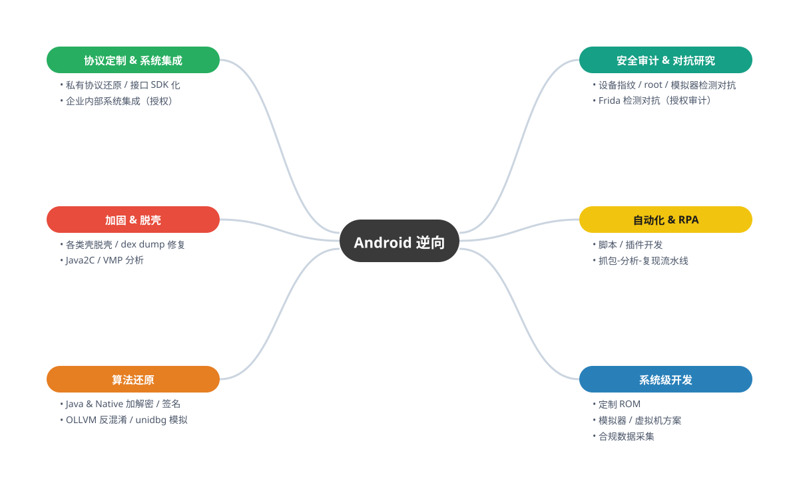
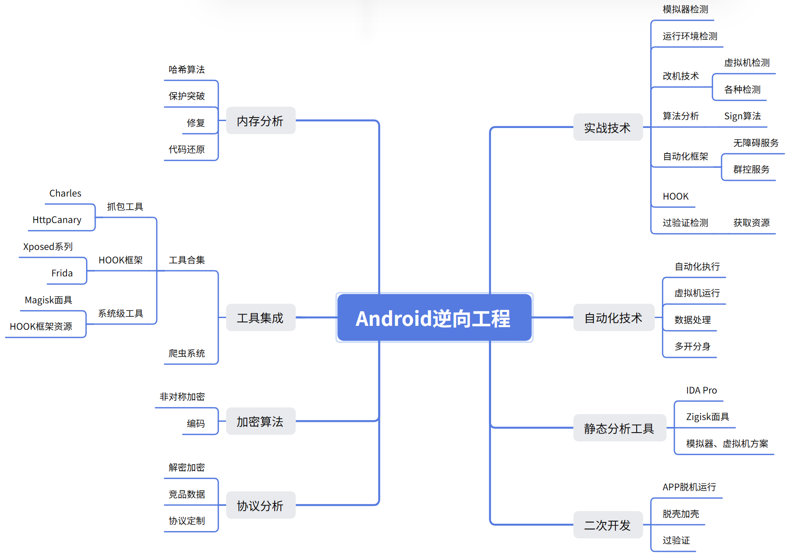
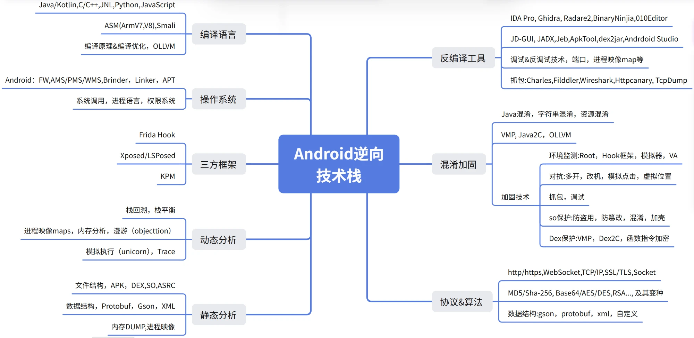

# 移动安全 · 安卓逆向工程 · 独立顾问

> 10+ 年移动互联网与安全工程经验，专注于安卓 / iOS 逆向、移动端协议分析与 RASP / 壳对抗研究。
>
> 仅承接**书面授权或自有 APP** 范围内的合规业务，接单前签署 NDA 与授权说明书。
> 联系方式（Telegram）：**[@pidanfuzi](https://t.me/pidanfuzi)**

> [!IMPORTANT]
> 🟢 **承接方向**：协议分析与还原 / 算法逆向（Java 与 Native）/ 加固脱壳与修复 / APP 风控与检测对抗研究 / 移动端安全审计 / 自动化与 RPA / 系统级方案（定制 ROM、模拟器与虚拟机）
>
> 🔴 **拒绝方向**：未授权破解他人付费应用、支付规避、游戏与赌博相关、侵犯用户隐私，以及任何违反目标所在地区法律法规的需求。

---

## ⭐ 代表性研究

> [**Reversing Promon SHIELD: From Emulator Detection to an Xposed Data-Only Patch**](docs/promon-shield.md)
>
> 一次**授权**前提下的 RASP / app-shielding 全链路对抗纪实：从崩溃栈回溯定位 native 检测源，通过位级（bit-level）实验矩阵逐条验证假设，最终将一次性 root 补丁演进为完全进程内、稳定可复用的 LSPosed 模块。覆盖 OLLVM 反混淆、多 base 映射、stale cache 处理与数据流补丁方法论——集中体现工程深度与技术严谨度的案例。

---

## 📦 业务方向

> 以下均为**授权范围内**的合规业务方向，表述已脱敏。

  

| 方向 | 说明 |
|---|---|
| **协议分析与定制** | 私有协议还原、接口 SDK 化、与企业内部系统集成（授权）→ 作品站：[andriodanalysis.com](https://andriodanalysis.com) |
| **算法还原** | Java 层与 Native（so）加解密、签名、token 逻辑还原，可交付 Python / Go / Node 复现 |
| **加固脱壳与修复** | 主流免费 / 企业壳脱壳、dex dump、运行修复，VMP / OLLVM / Java2C 分析 |
| **风控与检测对抗研究** | 设备指纹、root、模拟器、Frida 检测的识别与对抗（**限授权安全审计 / 自有 APP 防护测试**） |
| **自动化与 RPA** | 机械重复任务自动化、脚本与插件开发，构建"抓包—分析—复现"流水线 |
| **数据采集（合规）** | 授权范围内的 APP / 网页数据采集与竞品数据分析 |
| **系统级方案** | 定制 ROM、模拟器与虚拟机方案开发 → 作品站：[ypsmkj.us](https://ypsmkj.us) |
| **跨平台逆向** | Flutter / React Native / uni-app |

---

## 🧭 能力图谱

  

---

## 🛠 技术栈

  

**逆向与分析**
        

**Native / 汇编**
   

**脚本与复现**
   

**运行环境**
   

---

## 🌐 作品与产品

| 作品 | 说明 | 链接 |
|---|---|---|
| 虚拟机 / 云手机方案 | 自研模拟器与虚拟机环境，作为逆向与自动化基础设施 | [ypsmkj.us](https://ypsmkj.us) |
| 插件与协议定制站 | 协议还原、算法提取、插件与 SDK 定制交付 | [andriodanalysis.com](https://andriodanalysis.com) |

---

## 💼 代表性案例（已脱敏）

> 以下案例均已脱敏，仅说明技术方向，不涉及客户身份与具体产品信息。

- **Telegram 定制客户端** — 基于 Telegram 开源 API 的二次开发与定制实现。
  *安全提示：请勿使用来路不明的"定制版"客户端，此类软件可能暗藏后门；切勿因小失大。*
- **农用无人机控制板** — 嵌入式固件工程：修改出厂控制逻辑、参数调优（自有硬件）。
- **某竞品 APP** — 授权范围内还原 native（so）算法、解密 JavaScript 代码，交付算法说明文档。
- **某加固（壳）产品** — 授权安全分析：协议结构梳理、脱壳、风控检测对抗研究。
- **某 Flutter 应用** — Flutter Release 模式 so 逆向、Dart snapshot 分析、核心接口还原。
- **模拟器与设备指纹对抗研究** — 授权安全审计：模拟器改机、设备指纹与环境检测对抗（方法论同代表性研究文章）。
- **RASP 加固应用（Promon SHIELD）** — 全链路检测对抗 + LSPosed 数据流补丁，详见[代表性研究](docs/promon-shield.md)。

> 如需了解与您所在行业匹配的脱敏案例，请私信 [@pidanfuzi](https://t.me/pidanfuzi)。

---

## 📑 研究分析文档

### 🧩 Native 加固 / 去保护
- [VMP on Android Native Libraries: Internals, Tooling, and a Devirtualization Lab](docs/Native加固/vmp-android-native.md) — 虚拟机保护（VMP）原理、2026 主流去虚拟化工具链，以及"搭一个微型 VM 再写 lifter 拆掉它"的完整实战（[中文版](docs/Native加固/vmp-android-native.zh.md) / 🌐 [在线版 andriodanalysis.com](https://andriodanalysis.com/vmp-android-native.html)）
- [Reversing Promon SHIELD: From Emulator Detection to an Xposed Data-Only Patch](docs/Native加固/promon-shield.md) — RASP / app-shielding 全链路对抗 write-up

### 🔬 动态分析
- [Reversing VMP + OLLVM with a Frida Boundary-Hook Harness](docs/动态分析/frida-vmp-ollvm-hook.md) — 三层边界 Hook（libc / JNI / Java）动态还原 VMP+OLLVM 加固 native 的方法论与实战（[中文版](docs/动态分析/frida-vmp-ollvm-hook.zh.md) / 🌐 [在线版 andriodanalysis.com](https://andriodanalysis.com/frida-vmp-ollvm-hook.html)）

### 🔌 协议逆向
- [Reversing the UPI Wallet Protocol: From OTP Login to Transaction History](docs/协议逆向/upi-wallet-protocol.md) — 印度主流 UPI 钱包（Amazon Pay / PhonePe / Paytm 等）通用协议接口模型分析（[中文版](docs/协议逆向/upi-wallet-protocol.zh.md) / 🌐 [在线版 andriodanalysis.com](https://andriodanalysis.com/upi-wallet-protocol.html)）

### 🖥️ 虚拟化环境
- [Why Account-Matrix & Cloud-Phone Operators Need a Device-Level Android VM](docs/虚拟化环境/device-level-android-vm.md) — 账号矩阵/云手机/多开赛道的需求分析：从平台设备指纹与风控反推一台合格 Android 虚拟机必须具备的能力（定制内核 / Framework 层指纹控制 / 按实例隔离 / 传感器与网络一致性），贴合自研环境 CoderGeek（ypsmkj.us）（[中文版](docs/虚拟化环境/device-level-android-vm.zh.md) / 🌐 [在线版 andriodanalysis.com](https://andriodanalysis.com/android-virtual-environment.html)）

> 更多研究文档整理中，将陆续发布。

---

## 🌍 服务范围与交付语言

| 市场 | 渠道 |
|---|---|
| 🌐 海外（欧洲及全球） | Upwork · Fiverr · Freelancer |
| 🇨🇳 中文市场 | 淘宝 · 京东 · 闲鱼 · 私单 |

**交付语言**：中文 / English 双语均可——文档、代码注释与日常沟通均支持双语交付。

---

## 📈 行业趋势研判

1. **需求持续旺盛**：移动安全与协议分析人才长期供不应求，独立顾问模式启动成本可控。
2. **技术壁垒上移**：OLLVM / VMP / unidbg / Flutter / RASP 成为新的分水岭，对应单价持续走高。
3. **出海增量明确**：TikTok / Shopee / WhatsApp 及东南亚钱包类需求增长显著。
4. **合规化是主线**：纯破解灰产空间持续收窄，**授权安全审计、自有 APP 防护测试**才是长线价值所在。
5. **AI 工具加持**：LLM 辅助反混淆与注释正在成为新的生产力杠杆。

---

## 📞 联系方式

| 渠道 | 账号 |
|---|---|
| Telegram | [@pidanfuzi](https://t.me/pidanfuzi) |
| Email | `tomhamidi97@gmail.com` |
| GitHub | [@tomhamidi97-arch](https://github.com/tomhamidi97-arch) |

**接单流程**：需求沟通 → 报价与工期 → 签署授权 / NDA → 交付（脱敏报告 + 可运行脚本）→ 售后支持。

---

本仓库仅用于技术能力展示与合法授权业务承接，不提供任何未授权破解工具或服务。
